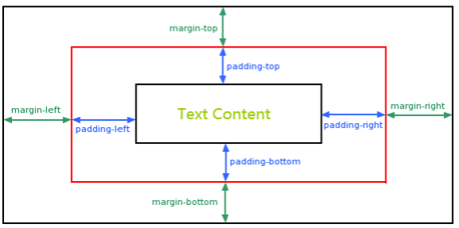

# css
css 定义网页的样式，其中最重要，最核心的概念是盒模型和布局(定位)。盒模型定义了样式的基本结构，布局定义了网页的展现形式。

# 盒模型



盒模型 `margin` 会合并，注意 `margin` 是和外围元素的 `margin`，不是和外部块元素的 `margin`。

盒模型中宽度和高度定义为：
```
元素总宽度 = 宽度 + 左内边距 + 右内边距 + 左边框 + 右边框 + 左外边距 + 右外边距
元素总高度 = 高度 + 上内边距 + 下内边距 + 上边框 + 下边框 + 上外边距 + 下外边距
```

*轮廓不包括在宽度、高度定义中。*

盒模型中以块为基本单位，`margin` 定义和外围元素的外边距，`padding` 定义边框和内部元素的内边距。如果改变内联元素的 `margin` 会发现 `margin` 只会改变元素左右的边距，如果改变内联元素的 `padding` 会发现 `padding` 不会改变元素的位置，而只改变元素的外围框边距，且元素的外围框是脱离于文档流的。示例如下：
```
<style>
  .center {
    margin: auto;
    width: 60%;
    border: 3px solid #73AD21;
    padding: 0px;
  }
  .text {
    border: 3px solid blue;
    margin: 0px;
    padding: 0px;
  }
  .text-inline {
    border: 3px solid orange;
    padding: 30px;
    margin: 0px;
  }
</style>

<body>
  <h1>居中对齐元素</h1>
  <p>要使块元素（例如 div）水平居中，请使用 margin: auto;</p>
  <div class="center">
    <p class="text">Hello World!</p>
    <span class="text-inline">行内元素</span>
    <span>行内元素的下个元素</span>
    <p>块元素</p>
  </div>
</body>
```

注意盒模型作为布局，这里的盒指的是块级元素而不是内联元素。


# 布局模型

网页布局的三种模型：
- 流动模型
- 浮动模型
- 层模型

不同模型有不同的属性。  

流动模型是默认的样子，元素通过块或内联的形式顺序排列。  
浮动模型通过 float 进行浮动，对于块浮动，其子元素继承浮动属性。  
层模型通过 `position` 定位，`position` 有相对定位，绝对定位和固定定位。相对定位是相对于正常位置的定位，相对定位是脱离于文档流的，其它元素的定位是相对于文档流的，示例见 [层模型之相对定位](https://www.imooc.com/code/2074)。绝对定位是脱离于文档流的定位，它定义的是元素的绝对位置，示例见 [层模型之绝对定位](https://www.imooc.com/code/2073)。固定定位也是脱离于文档流的，区别在于固定定位是相对于视口而言，示例见 [层模型之固定定位](https://www.imooc.com/code/2075)。

需要注意的是，绝对定位是相对于其最接近的具有定位属性的父包含块进行定位的，因此结合相对定位和绝对定位可以设计不同元素的层模型布局。
