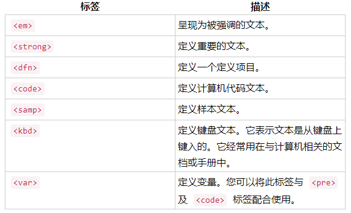
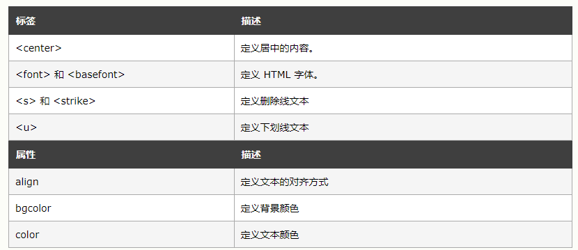

# HTML 

[HTML](https://www.w3school.com.cn/html/html_jianjie.asp) 是用来描述网页的超文本标记语言。

## HTML 标签

**什么是HTML 标签?**
- HTML 文档和 HTML 元素是通过 HTML 标签进行标记的
- HTML 标签是由尖括号包围的关键词，比如 <html>
- HTML 标签通常是成对出现的，比如 <b> 和 </b>
- 标签对中的第一个标签是开始标签，第二个标签是结束标签
- 开始和结束标签也被称为起始标签和闭合标签
- 某些 HTML 元素没有结束标签，比如  

注：某些 HTML 元素没有结束标签这点可以搭配 React 一起看。

<u>p 标签</u>  
p 标签会自动在其前后创建一些空白。浏览器会自动添加这些空间。

<u>短语标签</u>

<u>[文本](https://www.w3cschool.cn/minicourse/play/basehtml?cp=16376&gid=0)</u>  
下标文本将会显示在当前文本流中字符高度的一半为基准线的下方，但是与当前文本流中文字的字体和字号都是一样的。  
上标文本将会显示在当前文本流中字符高度的一半为基准线的上方，但是与当前文本流中文字的字体和字号都是一样的。  

<u>加粗文本</u>    

根据 HTML 5 的规范，b 标签应该做为最后的选择，只有在没有其他标记比较合适时才使用它。  

HTML 5 规范声明：标题应该用 ​"h1-h6"​ 标签表示，被强调的文本应该 ​em​ 标签表示，重要的文本应该用 ​strong 标签表示，被标记的或者高亮显示的文本应该用 ​mark ​标签表示。  
提示：您也可以使用 CSS 的 "font-weight" 属性设置粗体文本。

注：为什么不推荐使用，这里涉及到网页开发的演进。当表示层和内容层分离时，css 关注表示层，html 关注内容层。原先定义在 html 中的表示层标签也将 Deprecated。同时，对于某些没有语义信息的标签，如 b，可以被更具有语义信息的 strong 标签取代。详细了解参考 [答疑解惑：为什么某些HTML元素被弃用？](https://blog.csdn.net/duninet/article/details/106226191)。

**块级元素**  
div、h1~h6、blockquote、dl、dt、dd、form、hr、ol、p、pre、table、ul...

特点：总是在新行上开始，高度、行高以及顶和底边距都可控制，宽度缺省（默认）是它的容器的100%，除非设定一个宽度。  
功能：主要用来搭建网站架构、页面布局、承载内容。  

**行内元素**  
span、a、b、br、code、em、i、img、input、label、select、textarea...

特点：和其他元素都在一行上，高、行高及顶和底边距不可改变，宽度就是它的文字或图片的宽度，不可改变。  
功能：用于加强内容显示,控制细节，例如：加粗、斜体等等。

注：行内元素不能嵌套块级元素。

<u>[链接跳转](https://www.w3cschool.cn/minicourse/play/basehtml?cp=15812&gid=0)</u>  
​a ​元素也可以用在网页内不同区域的跳转。

设置​ a ​元素的 ​href ​属性值为井号 ​# ​加上想跳转区域对应的 ​id ​属性值，这样就可以创建一个内部跳转。  
​id ​是用来描述网页元素的一个属性，它的值在整个页面中唯一。  

<u>位置</u>

**text-align** 

文本对齐，这里的对齐是在文本标签块内对齐。

<u>代码约定</u>  
- 请始终定义图像尺寸。这样做会减少闪烁，因为浏览器会在图像加载之前为图像预留空间。思考，浏览器是怎么做的？

## 参考

[HTML 标签参考手册](https://www.w3school.com.cn/tags/index.asp)
[w3cshool 编程实战](https://www.w3cschool.cn/codecamp/list)
[HTML 实体符号参考手册](https://www.w3school.com.cn/charsets/ref_html_8859.asp)
[HTML 状态消息](https://www.w3school.com.cn/tags/html_ref_httpmessages.asp)
